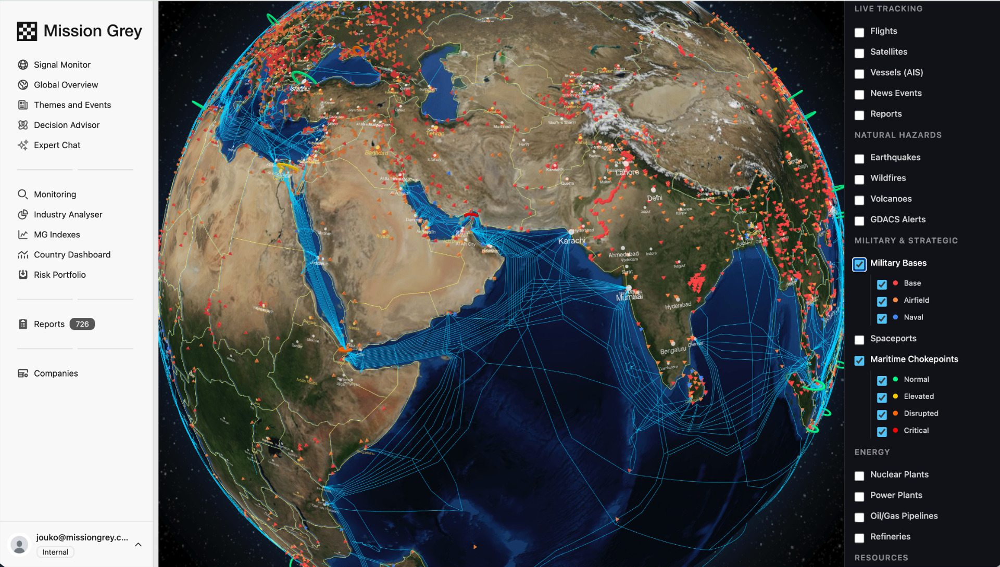

# Mission Grey site design system: component guide

For builders of sibling pages (`/platform`, `/solutions`, `/use-cases`,
`/partners-guild`, `/api`, `/insights`, `/about`, `/contact`, legal).
The homepage (`site/index.html`) is the reference implementation; this file
tells you how to stay on register. Read all of it before writing markup.

## Files and wiring

- `site/styles.css` is the whole design system. Link it with
  `<link rel="stylesheet" href="styles.css">` (relative; sibling pages that
  live in subfolders adjust the relative path accordingly, or sit flat in
  `site/`). Do not add page-local `<style>` blocks except for tiny
  page-specific layout that genuinely belongs nowhere else.
- Fonts live at `../fonts/*.woff2` relative to `site/` and are declared in
  `styles.css`. Never reference any external host for anything: no CDN, no
  analytics, no remote images. Assets come from `../assets/` on the ROOT page
(site/index.html) and `../../assets/` from sub-pages (`site/<page>/index.html`);
article-depth pages (`site/insights/<slug>/`) use `../../../assets/` and link
`../../styles.css`. Depth decides the prefix, always.
- Internal links are root-relative WITHOUT any base prefix and with a
  trailing slash: `href="/platform/"`. A base-path rewrite happens at
  deploy time; never write `/new/` into markup.
- Log in goes to `https://app.missiongrey.com/`. Request access goes to
  `/contact/`. Book a demo goes to
  `https://calendly.com/lauri-missiongrey/30min`.
- Every page: `<a class="skip">`, one `<h1>`, semantic landmarks
  (`header/main/footer/nav/section`), the shared header and footer copied
  from `index.html` verbatim (only the current-page nav item may change
  state if you add one).

## Palette tokens

| Token | Value | Use |
|---|---|---|
| `--bg` | `#0A0C10` | page ground. The site is dark; there is no light theme. |
| `--bg-1` | `#0E1116` | raised surfaces, alternate bands (`.sec-alt`) |
| `--bg-2` | `#12161C` | chrome bars, hover surfaces |
| `--line` / `--line-2` | white at 8% / 15% | hairlines / emphasized hairlines and corner ticks |
| `--ink` | `#E9EDF1` | headings, primary emphasis |
| `--ink-body` | `#B6BEC7` | body copy |
| `--ink-mute` | `#8B95A0` | secondary copy |
| `--ink-dim` | `#78828F` | labels and metadata; do not go dimmer than this for text |
| `--signal` | `#E2A33C` | THE accent. Amber means "live signal": status dots, markers, the eyebrow tick, focus rings, stage numbers. Never use it for decoration, large fills, or body text. One accent per component is the ceiling. |
| `--paper*` | warm paper set | ONLY inside `.sheet` artifacts (see below). Paper never leaks onto the dark chassis. |

Type scale tokens: `--fs-hero`, `--fs-h2`, `--fs-h3`, `--fs-lede`,
`--fs-body`, `--fs-small`, `--fs-label`. Spacing: `--sec-pad` (section
padding), `--head-gap`, `--max` (1200px content), `--max-nav` (1360px
header), `--pad` (24px gutters).

## Type system and voice

- `--sans` (Inter): headings, body, UI. Headings weight 600, tight
  tracking (inherited from base styles; do not override).
- `--mono` (JetBrains Mono): the instrument voice. All eyebrows, labels,
  buttons, captions, nav links, metadata. Mono text is small (10 to 13px),
  uppercase, letter-spaced. Mono is never used for paragraphs.
- `--serif` (Source Serif 4): the document voice. ONLY inside paper
  artifacts (`.sheet`) and long-form editorial content (insight articles).
  Never for UI on the dark chassis.

Copy register: senior, concrete, calm. Sentences state facts and stop.
No hype adjectives, no "revolutionary", no "cutting-edge". Style law
(binding): **no em dashes, no en dashes, no exclamation marks** anywhere
in user-facing text. Use commas, colons, periods, or the middot entity
`&middot;` for label separators. American English. Headings are
sentence case and usually end with a period ("The instrument set.").
Non-breaking hyphen `&#8209;` in compound words that must not break
("decision&#8209;ready").

## Honesty labeling (binding convention)

Three tiers of imagery, three chromes. Never mix them.

1. **Real product screenshot** → `.window` with browser chrome and the
   `app.missiongrey.com` url pill. Only actual, unretouched screenshots of
   the shipping product may sit inside a `.window`. The chrome is the
   claim "this is the product"; putting anything else in it is a false
   claim.
2. **Illustrative instrument** (drawn SVG maps, charts, diagrams) →
   `.frame` with corner ticks and a `.frame-bar` that carries the label
   `Illustrative view` on the right (`<span class="dim">Illustrative
   view</span>`). Drawn graphics never carry fabricated real-world numbers
   presented as fact.
3. **Illustrative document** (the Morning Brief and any other printed
   artifact) → `.sheet`, which must carry BOTH the
   `<span class="bf-tag">Illustrative edition</span>` tag in its header
   AND a figcaption ending in a sentence equivalent to "Contents shown are
   illustrative, not live intelligence."

No hardcoded dates anywhere on any page. Live datelines and clocks are
JS-written with a dateless static fallback (see Clock below). A copyright
year in the footer is the only permitted literal year.

## Claims law

Every factual claim (numbers, cadence, partners, quotes, ratings,
capabilities) must trace to something already published by Mission Grey:
the previous site, the platform itself, or a signed-off source a
Mission Grey lead can name. You may soften or drop claims;
you may not invent, upgrade, or extrapolate them. No customer names, no
logo walls, no customer counts, no pricing. Testimonials are quoted
verbatim with their exact anonymous attributions.

## Components

### Header (copy verbatim from index.html)

Sticky, blurred, hairline bottom. Desktop nav: Platform, Solutions,
Use cases, Partners, API, Insights, About + UTC clock + Log in + Request
access button. Mobile (`<=980px`): `details.mnav` burger panel including
Contact. Logo is `../assets/mission-grey-logo-white.png` at `height:24px`.

### Clock

```html
<span class="utc" id="utc" aria-hidden="true"></span>
```
Left empty in markup; `.utc:empty{display:none}` hides it without JS. The
inline script writes `UTC hh:mm:ss` every second. Never prefill a time.

### Footer (copy verbatim from index.html)

Brand column (logo, one-line description, entity line "Mission Grey, Inc.
&middot; Delaware, United States"), then Platform / Solutions / Company /
Contact columns, offices line, legal row with
"&copy; 2026 Mission Grey. All rights reserved.", Privacy Policy, Terms
of Use, and the tag "Built for enterprise decision&#8209;makers".

### Section scaffold

```html
<section class="sec" id="..." aria-labelledby="x-h">
  <div class="wrap">
    <p class="rule-label">Chapter name</p>
    <div class="sec-head reveal" style="margin-top:44px">
      <p class="eyebrow">Three word framing</p>
      <h2 id="x-h">The section claim, as a sentence.</h2>
      <p>One dek paragraph, optional.</p>
    </div>
    ...
  </div>
</section>
```
`.rule-label` is the full-width chapter divider; use it when a section
starts a new chapter of the page, omit it for continuations. Add class
`sec-alt` for the raised band variant (used at most every other section;
two adjacent `sec-alt` bands are a composition error). A page hero for
sub-pages is the same scaffold with `<h1>` instead of `<h2>` and
`--fs-hero` scale, plus the `.hero-eyebrow` spacing.

### Eyebrow and rule label

`.eyebrow` = mono uppercase with a 14px amber tick. `.rule-label` = mono
uppercase with a trailing hairline. Both already styled; never restyle.

### Buttons

```html
<a class="btn btn-primary" href="/contact/">Request access</a>
<a class="btn btn-ghost" href="...">Book a demo</a>
```
Primary is the light block; ghost is the hairline. Never invent a third
variant, never put amber in a button. CTA pairs: primary first.

### Corner-tick frame (instrument chrome)

```html
<div class="frame"><span class="tick"></span>
  <div class="frame-bar">
    <span class="live">Panel title</span>
    <span class="dim">Illustrative view</span>
  </div>
  ...content...
  <div class="frame-legend">
    <span class="li"><span class="sw amber"></span>Meaning</span>
  </div>
</div>
```
The `<span class="tick"></span>` child is required (it draws the bottom
corner ticks). `.frame-bar .live` gets the blinking amber dot; use it only
on panels that represent continuous processes. Legend optional.

### Window (real product screenshots only)

```html
<figure class="shotfig">
  <div class="window">
    <div class="chrome" aria-hidden="true"><i></i><i></i><i></i><span class="url">app.missiongrey.com</span></div>
    <div class="win-body"></div>
  </div>
  <figcaption class="win-cap">Caption in mono</figcaption>
</figure>
```
Add `class="win-body crop"` to crop tall screenshots to 16:9.6 (top
anchored). Always set `width`/`height` attributes and a real descriptive
`alt`. `loading="lazy"` below the fold.

### Duo cards (paired screenshots with captions)

```html
<div class="duo">
  <figure class="shotfig dcard reveal">
    ...window with crop...
    <figcaption><h4>Claim</h4><p>One supporting sentence.</p></figcaption>
  </figure>
  ...second card...
</div>
```

### Sheet (paper artifact)

```html
<figure class="artifact reveal">
  <div class="sheet" role="img" aria-label="...describe, state contents are illustrative...">
    <div class="bf-head">
      <div class="bf-title">[mark svg] <b>The Morning Brief</b></div>
      <span class="bf-tag">Illustrative edition</span>
    </div>
    <div class="bf-date"><span id="bf-date">Daily edition &middot; 06:00 UTC</span><span>Prepared for: your organization</span></div>
    ...bf-lead / bf-rec / bf-items / bf-foot (see index.html)...
  </div>
  <figcaption><b>Above</b>...ends with the illustrative sentence.</figcaption>
</figure>
```
Serif inside, paper tokens only, both honesty labels mandatory. The
dateline is JS-written; the static fallback stays dateless.

### Cadence band

```html
<div class="cadence" role="list" aria-label="Operating cadence">
  <div role="listitem"><span class="v">4x daily</span><span class="k">News pipeline</span></div>
  ...
</div>
```
Exactly four cells on the homepage; reuse only with register-backed
numbers.

### Proof strip

```html
<section class="proofstrip" aria-label="...">
  <div class="wrap strip-row">
    <span class="strip-label">Research partnerships</span>
    <span class="inst">University of Cambridge<small>Judge Business School</small></span>
    ...
    <span class="strip-rule" aria-hidden="true"></span>
    <a class="strip-g2" href="...">Rated 5.0&#8201;/&#8201;5 by users on G2</a>
  </div>
</section>
```

### Stages (numbered narrative rows)

`.stage` = 5/7 copy+media grid, `.stage.flip` mirrors it. `.stage-num`
carries `01 &middot; MONITOR` in amber mono. `.stage-io` is the
INPUT/OUTPUT line. Media slot takes a `.shotfig` window.

### Capability cards

`.caps` grid of `.cap` articles: `cap-meta` (index `CAP&#8201;/&#8201;01`
+ 22px stroke icon), `h3`, one sentence. Icons are 1.5 stroke inline SVG,
`stroke:currentColor` inherited, no fills.

### Trust pipe and grid

`.pipe` = node/link chain (`Signal Model Decision Review`); `.trust-grid`
= 4 hairline cells with mono h3 labels.

### Sector index

`.sectors` list of `.sector` rows: mono `code` with amber 3-letter prefix,
`desc`, `out` with the amber arrow SVG (copy the 14x10 arrow from
index.html).

### Quotes

`.quote-main` (amber left rule, large quote, `.attr` mono attribution) +
`.quote-row` cells. Quotes are register-verbatim; attribution format
`Role &middot; Org type &middot; name withheld`.

### Chips

`.chips` > `.chip` for domain tags. Mono, hairline, no interaction.

### Access panel

`.frame.access-panel` with tick span, centered: eyebrow, h2, one line,
CTA pair, `access-mail`. Ends every page that wants a close.

### The mark

Inline SVG checkerboard (fixed brand element, redraw nothing):

```html
<svg viewBox="0 0 36 36" aria-hidden="true">
  <rect width="36" height="36" fill="#181510"/>
  <path fill="#FDFCF8" d="M11 4h7v7h-7zM25 4h7v7h-7zM4 11h7v7H4zM18 11h7v7h-7zM11 18h7v7h-7zM25 18h7v7h-7zM4 25h7v7H4zM18 25h7v7h-7z"/>
</svg>
```
On the dark chassis use the PNG logo for the wordmark; the SVG mark is for
paper artifacts and small brand moments. The `.checker` utility (6px
conic-gradient checkerboard) is the mark at its smallest: a bullet or
caption marker, amber on dark. Use `.win-cap::before` and `.checker` as
the only list-marker treatments.

### Reveal motion

Add class `reveal` to blocks that should rise in on scroll. The shared
script (copy from index.html) gates it behind `html.js`, so no-JS shows
everything; `prefers-reduced-motion` disables it entirely. Do not invent
other animations. Permitted motion inventory: reveal rise, the blink dot,
the map ping, sheet hover lift, color transitions. Nothing else moves.

## Layout and responsive rules

- Content max 1200px (`.wrap`), header 1360px. Breakpoints in use: 1200
  (clock hides), 980 (burger nav, hero stacks), 900 (grids collapse), 700
  (cadence 2x2, map labels hide, url pill hides), 560 (single column,
  full-width buttons).
- Test 1440 and 390. No horizontal scroll anywhere at any width. Wide
  content scrolls inside its own container, never the page.
- Images: always `width`/`height` attributes, `loading="lazy"` below the
  fold, real alt text.
- Accessibility floor: WCAG AA contrast (never set text dimmer than
  `--ink-dim` on `--bg` or smaller than the sizes used here), visible
  focus (`:focus-visible` amber ring is global), aria-labels on icon-only
  controls and every `nav`.
- Weight: keep each page's HTML+CSS+JS under ~400KB before fonts. No
  base64 images. Zero external network requests.


## Integration-round additions (2026-08-22, #80)

- Active nav: mark the current page's nav link with `aria-current="page"`;
  styles.css now carries the state (`.nav-main a[aria-current="page"]`).
- Access panel: the `.access-mail` top-margin fix lives in styles.css; do
  not re-fix locally.
- Sub-page hero convention: `class="hero sec"` on the hero section, one
  `<h1>`, single column (builder-A pattern, adopted site-wide).
- Long-form registers in the wild: legal pages use a sans `.doc-*` layout
  (reference material), articles use the serif `.art-*` layout (editorial).
  Both are page-local for now; promotion into styles.css is a post-preview
  cleanup decision.


## Production round additions (2026-08-22)

### Head block every page carries

Below the existing title / description / canonical / og / twitter set:

```html
<link rel="icon" href="/favicon.ico" sizes="any">
<link rel="icon" type="image/png" href="../assets/favicon-180.png">
<link rel="apple-touch-icon" href="/assets/favicon-180.png">
<link rel="stylesheet" href="styles.css">
<script src="../assets/consent.js" data-ga="__GA_MEASUREMENT_ID__" defer></script>
```

The two icon links that start with `/` are deliberate: the site is served
from the apex, and `/favicon.ico` is fetched by browsers whether it is
linked or not. Everything else keeps the depth rule. `twitter:card` is
mandatory now; `404.html` carries no canonical and no `og:url` on purpose,
because Pages serves it at every address.

Social images: an article's `og:image` and `twitter:image` are that
article's own cover, so a shared link previews the piece rather than the
brand. Every other page uses `/assets/og-image.jpg`. Write both as
root-relative paths; the build makes them absolute.

Structured data: the home page carries `Organization` + `WebSite`, each
article carries `Article`, as `application/ld+json` in the head. Every value
in them is a fact already printed on the page (h1, byline, `<time>`, cover
image). Do not put anything in JSON-LD that a reader cannot see.

### Consent notice (styles.css section 14)

The one exception to "zero external network requests": Google Analytics 4,
and only after the visitor clicks `Allow`. `assets/consent.js` renders the
notice, stores the answer under `mg-consent`, and injects gtag.js only in
the granted case. While `data-ga` still holds the build token, the script
returns immediately: no banner, no request. So the default state of the
site is still zero external requests.

The notice is the second paper object in the system, alongside `.sheet`. It
reads as a printed slip laid on the desk rather than as UI chrome, which is
why it uses the paper tokens on the dark chassis. It has no motion of any
kind. If the register ruling changes, the whole component is the
`.consent*` block at the end of styles.css.

### Asset formats

Photographic covers are JPEG, flat illustrations and diagrams are PNG. A
photograph saved as PNG costs several megabytes for no gain. Keep every
cover under about 400KB and run `-auto-orient` before stripping metadata,
otherwise a phone photo with an EXIF rotation flag loses it and lands
sideways.
